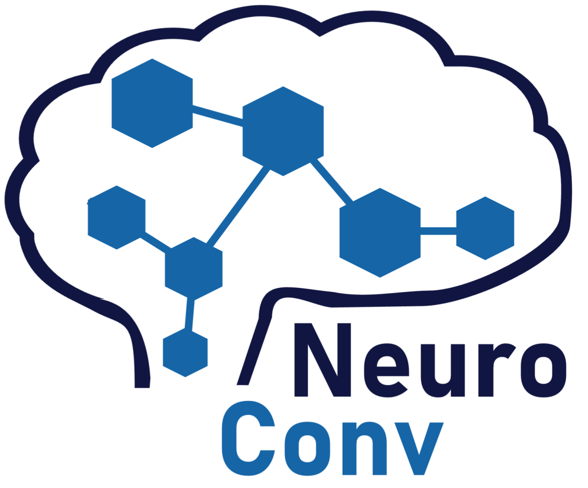

[](https://badge.fury.io/py/neuroconv.svg)


[](https://codecov.io/github/catalystneuro/neuroconv?branch=main)
[](https://neuroconv.readthedocs.io/en/main/)
[](https://github.com/catalystneuro/neuroconv/license.txt)

<p align="center">
  
  <h3 align="center">Automatically convert neurophysiology data to NWB</h3>
</p>
<p align="center">
   <a href="https://neuroconv.readthedocs.io/"><strong>Explore our documentation »</strong></a>
</p>


<!-- TABLE OF CONTENTS -->

## Table of Contents

- [About](#about)
- [Installation](#installation)
- [Documentation](#documentation)
- [License](#license)

## About

NeuroConv is a Python package for converting neurophysiology data in a variety of proprietary formats to the [Neurodata Without Borders (NWB)](http://nwb.org) standard.

Features:

* Reads data from 40 popular neurophysiology data formats and writes to NWB using best practices.
* Extracts relevant metadata from each format.
* Handles large data volume by reading datasets piece-wise.
* Minimizes the size of the NWB files by automatically applying chunking and lossless compression.
* Supports ensembles of multiple data streams, and supports common methods for temporal alignment of streams.

## Installation
To install the latest stable release of **neuroconv** though PyPI, type:
```shell
pip install neuroconv
```

For more flexibility we recommend installing the latest version directly from GitHub. The following commands create an environment with all the required dependencies and the latest updates:

```shell
git clone https://github.com/catalystneuro/neuroconv
cd neuroconv
conda env create -f make_environment.yml
conda activate neuroconv_environment
```
Note that this will install the package in [editable mode](https://pip.pypa.io/en/stable/cli/pip_install/#editable-installs).

Finally, if you prefer to avoid `conda` altogether, the following commands provide a clean installation within the current environment:
```shell
pip install git+https://github.com/catalystneuro/neuroconv.git@main
```

## Documentation
See our [ReadTheDocs page](https://neuroconv.readthedocs.io/en/main/) for full documentation, including a gallery of all supported formats.

## License
NeuroConv is distributed under the BSD3 License. See [LICENSE](https://github.com/catalystneuro/neuroconv/blob/main/license.txt) for more information.
