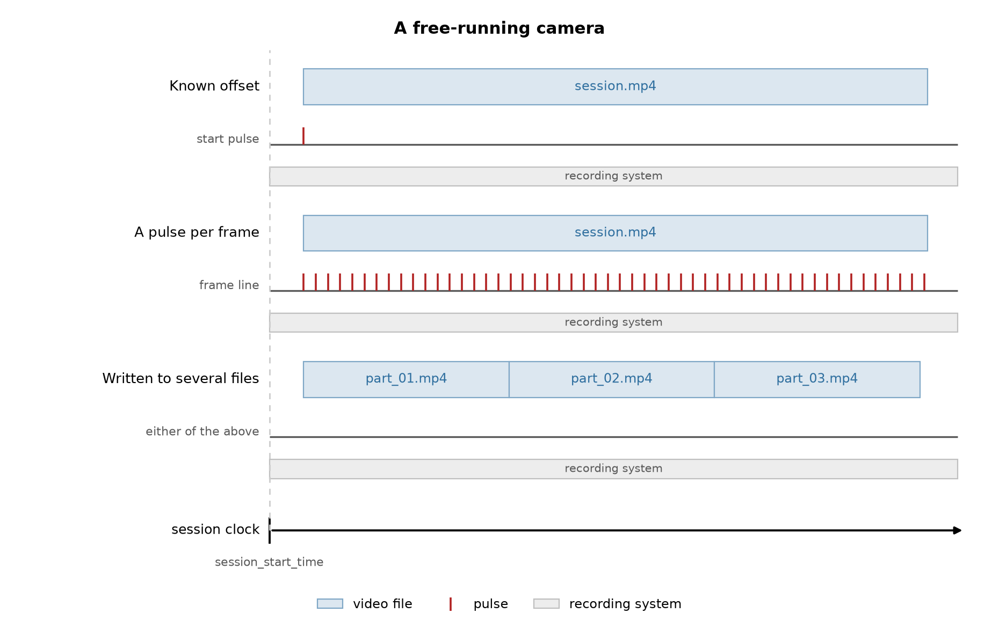
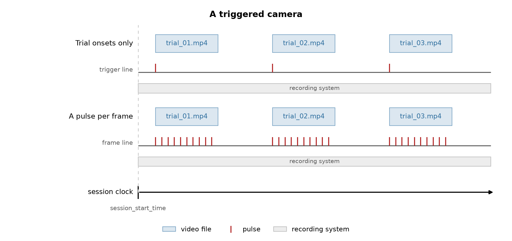

.. _align_external_video:

How to Time Align Behavior Videos to Other Modalities
=====================================================

A camera is its own acquisition system, and it is almost never on the same clock as whatever it is
recording alongside. The times it stamps its frames with are its own, so before any frame can be read
against another signal it has to be expressed on the session clock. That is the job this guide is about.

Most rigs record behavior video alongside something else: extracellular electrophysiology, fiber
photometry, optical imaging, an operant box. The camera is on its own clock in every one of them, so the
recipes below cover those setups together. What changes between them is how the camera's output is
chunked and what the cable between the two systems carried.

This guide covers :py:class:`~neuroconv.datainterfaces.behavior.video.externalvideointerface.ExternalVideoInterface`,
which leaves the video on disk and writes an ``ImageSeries`` pointing at it. For the generic
synchronization methods and how they relate to each other, see the
:doc:`temporal alignment user guide <../user_guide/temporal_alignment>`.

What the session produced
-------------------------

Two things: a recording that ran for the whole session, and video that may or may not have. The recording
is the other modality, whichever it is, and it matters here for two reasons. Its clock is normally the
session clock, because everything else in the rig is wired into it. And its digital inputs are where the
camera's timing signal was captured, so it is also the instrument that measures the video.

The video arrives in one of two arrangements, and they are the two sections below. Every case in them
is drawn the same way: the video files on top, the digital line that timed them below, and a band for the
recording system running underneath, with a dashed guide at the session start so the gap before a row's
first file reads as its offset.

**A free-running camera.** It runs for the session and stops when the session does. Whether that lands in one
file or several is a decision the recording software made about file size or a timer, and it changes nothing
about the timing: the frames are one continuous stream either way.

         block over a line pulsing continuously. And three blocks touching end to end, written by a
         recorder that rotated its output, whose line is labelled "either of the above" because the split
         is a storage detail rather than a timing one.

**A triggered camera.** A pulse starts it at each trial, so the session yields one file per trial with real
gaps between them. This is the trialized case, and there the gaps are the intent rather than an artifact.

         one pulse at each block's start. And the same separated blocks over a line pulsing only while a
         block runs, so the pulses arrive in three bursts.

Note that the two figures hold the same three files, touching in one and separated in the other. That is
the whole difficulty: the files on disk look identical, and only what the rig did tells them apart.

How they are wired, and where the times come from
-------------------------------------------------

Between the camera and the recording system there is usually a cable, and what runs along it decides how
well you can do. It is the second of the two things that pick a recipe: the arrangement above says how
many placements you have to make, and the cable says how good each one can be.

.. image:: ../_static/images/video_wiring.png
   :width: 760px
   :align: center
   :alt: Four panels in a two by two grid, each holding a camera box on the left and a recording system box
         on the right, so the only thing that differs between them is what runs in between. In "the camera
         reports" an arrow runs from the camera to the recording system, labelled frame-out line, one pulse
         per frame, with a note that each pulse is evidence a frame was exposed so the count can be checked
         against the file. In "the camera is commanded" the arrow runs the other way, from the recording
         system to the camera, labelled trigger line, one pulse per trial, with a note that the trigger is
         recorded on its way out so its time is known but the delay to the first exposed frame is not
         measured. In "a shared sync source" a third box sits above the two and one line fans out from it
         into both, with a note that neither system commands the other and both write down when each pulse
         arrived, so the pairs map one clock onto the other. In "no cable" the two boxes stand alone with
         nothing between them.

**The camera reports.** The camera has a frame-out or strobe pin that fires each time it exposes a frame,
wired into a digital input on the recording system. Every frame therefore has a time measured on the session
clock, which is the best case: it corrects drift, and because a pulse is evidence a frame happened, the pulse
count is a fact you can check the video file against.

**The camera is commanded.** The line runs the other way, from the controller or the recording system into the
camera's trigger input, and the same line is recorded on a digital input so its time is known. What was
measured is the command, not a confirmation, so the delay from trigger to first exposed frame is unmeasured
and nothing in the file records it. Within a trial the frame times then come from the nominal frame rate
rather than from measurement.

**A shared sync source.** A third box, an Arduino or a Bonsai workflow, emits pulses into a general-purpose
input on the camera and into a digital input on the recording system at once. Neither system commands the
other; both only write down when each pulse arrived. That is what makes the camera's own clock usable,
because the same instants now appear in the camera's metadata and in the recording, and the pairs define
the map between the two clocks. Pulses are often emitted in coded groups, a "barcode", so a pair cannot be
lined up wrong even if one of the systems missed one.

**No cable.** Then you have only whatever someone wrote down, a start time and nothing relating the two clocks
after that instant.

One combination has no recipe at all, and is worth naming: one file per trial with no line.
Nothing in the recording then says where the trials sit, so the starting times have to come from somewhere
else, a behavioral log or the files' modification times, and be set by hand.

**Reading the line.** Whichever direction it points, the line lands on a digital input of the recording system
and is read the same way. Name it in the header, configure it, and read it back without writing anything:

.. code-block:: python

    from neuroconv.datainterfaces import IntanDigitalInterface, IntanRecordingInterface

    recording_interface = IntanRecordingInterface(file_path="session.rhd")
    digital_interface = IntanDigitalInterface(
        file_path="session.rhd",
        detection_configuration={
            "DIGITAL-IN-02": [
                {
                    "signal_conditioning": {"binarize": "midpoint"},
                    "detection": "rising",
                    "event_name": "camera_frame",
                }
            ]
        },
    )

    frame_pulse_times = digital_interface.get_event_times("camera_frame")

Reading the pulses off the recording system is also what decides the clock. Times measured on an Intan
digital line are on the Intan clock, so the frames you hand them to land there too. That is the session
clock by construction as long as the recording interface is left where it is, which is the usual
arrangement: one system is the master because everything else is wired into it, it is not shifted, and
every other stream is expressed in its clock. If you do move the recording, shift it before you read, so
the pulses come back already carrying the shift.

What goes in ``detection_configuration`` is :ref:`how a signal becomes a line <events_conditioning>` and
:ref:`how a line becomes events <events_detection>`.

A free-running camera
---------------------

One camera, running for the session, writing one file. The interface writes one ``ImageSeries``, and the
only question is what timed it.

.. code-block:: python

    from neuroconv.datainterfaces import ExternalVideoInterface

    interface = ExternalVideoInterface(file_paths=["session.avi"], video_name="BehaviorCamera")
    interface.alignment.keys()
    # ('session',)

Each video file is addressable for alignment under the stem of its path, which for a single video means
one key. Note that a single video writes with no alignment call at all, claiming it started exactly at
``session_start_time``. That is a claim worth checking rather than accepting.

Where a session has more than one camera, give each interface its own ``metadata_key``. It addresses that
camera's entry in ``metadata["Behavior"]["ExternalVideos"]``, which keeps the two ``ImageSeries`` and their
devices apart, and it is what a ``PoseEstimation`` container names when it says which video its keypoints
were tracked from (see :ref:`annotate_pose_metadata`).

**Known offset.** All you know is when the camera started relative to the session start.

.. code-block:: python

    interface.alignment.shift_times(12.5)

Frame times come from the video's own frame rate, moved rigidly by the offset. This corrects the start and
nothing else: two clocks that differ by a constant today will differ by more of one an hour from now, so a
long session on a free-running camera accumulates error that no single number can fix.

**A pulse per frame.** The camera sent a pulse on every frame it captured, so the recording system timestamped
each frame directly. This is accurate and corrects drift, so prefer it whenever the pulses exist.

.. code-block:: python

    frame_pulse_times = digital_interface.get_event_times("camera_frame")

    interface.alignment["session"].set_times(frame_pulse_times)

You do not have to count them first: the interface refuses times that do not number one per frame and says
how far out they are. Many more pulses than frames usually means the line was running before the camera, so
you want the tail of it. A few short means dropped frames, and do not trim the pulses to fit, because most
recorders stamp each frame with its index rather than its time, so a drop closes the gap instead of leaving
one and every later frame is written early; the pulses are the only record of where the missing frames were.

**The camera keeps its own clock.** The camera writes a timestamp for every frame it captures, and a shared
sync source sends pulses into both systems, so the camera's log holds a time for every frame and a time for
every sync pulse, all on the camera's clock. The frame times are already the right shape, one per frame,
but on the wrong clock; the sync pulses are the instants both systems wrote down, so they are what turns
one clock into the other. A shift will not do it, because the two clocks drift.

.. code-block:: python

    # Read from whatever the camera's acquisition software wrote, both on the camera's own clock.
    frame_times = ...  # one per frame
    camera_sync_times = ...  # one per sync pulse

    # The same pulses, as the recording system timestamped them, on the session clock.
    recording_system_sync_times = digital_interface.get_event_times("camera_sync")

    interface.alignment["session"].set_times(frame_times)
    interface.alignment.remap_times(
        local_sync_times=camera_sync_times,
        reference_sync_times=recording_system_sync_times,
    )

Set the log's times first, which puts the video on the camera's clock, then remap that clock onto the
session's. The two pulse arrays pair up positionally, so they have to be the same length and in the same
order, and a pulse only one of the systems recorded has to be dropped from both. Frames between two pulses
are interpolated proportionally and none of the data is resampled, only the times move.

``remap_times`` is called on ``alignment`` rather than on one key, because one clock means one correction,
so a trialized camera on its own clock takes the same call after its files have been placed.

**When the recorder split the session into several files.** Still one continuous recording, but the software
was set to open a new file every few minutes, so it arrives as several. Whether that changes the timing
depends on the recorder: if it dropped no frames while closing one file and opening the next, the files run
back to back and each starts where the last one ended, which the frame counts and rates give you. Nothing in
the files records a gap if there was one, so if the rig has a frame-out line, use it and take each file's
times from the pulses instead.

.. code-block:: python

    import numpy as np

    interface = ExternalVideoInterface(file_paths=["part_01.avi", "part_02.avi", "part_03.avi"])

    frame_counts = interface.get_header_frame_counts()
    frame_rates = interface.get_header_frame_rates()
    durations = np.array(frame_counts) / np.array(frame_rates)
    starting_times = np.concatenate([[0.0], np.cumsum(durations)[:-1]])

    for segment_key, start, count, rate in zip(interface.alignment.keys(), starting_times, frame_counts, frame_rates):
        segment_timestamps = np.arange(count) / rate
        interface.alignment[segment_key].set_times(start + segment_timestamps)

A triggered camera, one file per trial
--------------------------------------

One camera again, but a pulse triggers it at the start of each trial, so the session yields one file per
trial with real gaps between them. Each file's placement is an independent fact.

``ExternalVideoInterface(file_paths=[...])`` writes a **single** ``ImageSeries`` whose ``external_file``
list is as long as the input. A session of forty trials is one container with forty entries. That container
carries the trial order in the ``external_file`` list and the frame numbering in ``starting_frame``, over
one timestamps vector, so a reader gets the session's structure from the object itself; split into forty
containers it has to be reconstructed from their names. ``starting_frame``, which marks where each external
file begins within the series, is computed from the frame counts and never appears in your code.

.. code-block:: python

    interface = ExternalVideoInterface(file_paths=["trial_01.avi", "trial_02.avi", "trial_03.avi"])
    interface.alignment.keys()
    # ('trial_01', 'trial_02', 'trial_03')

If two trials write files with the same name in different folders, rename them. The stem is how a file is
addressed, so it has to be unique, and the interface raises at construction rather than silently merging
two handles.

**Trial onsets only.** The digital line recorded the triggers and nothing else.

.. code-block:: python

    trial_onsets = digital_interface.get_event_times("camera_trigger")
    segment_keys = interface.alignment.keys()
    assert len(trial_onsets) == len(segment_keys)

    frame_counts = interface.get_header_frame_counts()
    frame_rates = interface.get_header_frame_rates()

    for segment_key, onset, count, rate in zip(segment_keys, trial_onsets, frame_counts, frame_rates):
        segment_timestamps = np.arange(count) / rate
        interface.alignment[segment_key].set_times(onset + segment_timestamps)

Each file is placed where its trigger fired, and within a file the frame times come from the nominal frame
rate. So the no-drift caveat from the known-offset case returns, but per trial rather than once for the
session, which is usually fine: a trial is short, and a camera does not drift far in ten seconds.

``set_times`` is **absolute**, so running that loop twice leaves the files where the second run says
rather than moving them twice.

Within a trial the frame times rest entirely on the rate the container declares, and a header can be wrong
without the file saying so: an IBL Brain Wide Map camera declares exactly 150 fps against a
hardware-measured 150.4083, which is 11.5 seconds by the end of a session on frames that are perfectly
evenly spaced. Over a ten-second trial that is a millisecond and nobody cares. Over a long trial, or a
session written as one file, it is worth using the pulses below instead.

**A pulse per frame.** The richest case, and the one to ask for when a rig is being designed. A frame-out line
that is active only while the camera is running gives you both structures at once, because the pulses arrive
in bursts, one burst per trial: the burst onsets are where the files start, and the pulses within a burst are
the frame times of that file.

.. code-block:: python

    import numpy as np

    frame_pulse_times = digital_interface.get_event_times("camera_frame")

    # The gap between trials is far larger than the frame interval, so the split is unambiguous.
    frame_interval = np.median(np.diff(frame_pulse_times))
    gap_indices = np.flatnonzero(np.diff(frame_pulse_times) > 10 * frame_interval) + 1
    bursts = np.split(frame_pulse_times, gap_indices)

    segment_keys = interface.alignment.keys()
    frame_counts = interface.get_header_frame_counts()

    assert len(bursts) == len(segment_keys), f"{len(bursts)} bursts for {len(segment_keys)} files."
    for segment_key, burst, frame_count in zip(segment_keys, bursts, frame_counts):
        assert len(burst) == frame_count, f"{segment_key}: {len(burst)} pulses for {frame_count} frames."
        interface.alignment[segment_key].set_times(burst)

If either assertion fires, the pulse record and the files disagree about the session and the cause has to
be found before the timestamps mean anything. A trial that was triggered but never reached disk is the
usual one, and it puts every later file onto the wrong trial's pulses. Without the check ``zip`` stops at
the shorter of the two and the result looks fine.

**A second line makes the split more robust.** If the rig also has a line marking when each trial began, bin
the frame pulses between consecutive trial onsets instead of splitting on the gaps. It needs no threshold, and
a trial that recorded no frames comes back as an empty burst, which the frame-count assertion then catches,
rather than being silently merged into its neighbour.

.. code-block:: python

    trial_onsets = digital_interface.get_event_times("camera_trigger")
    bursts = np.split(frame_pulse_times, np.searchsorted(frame_pulse_times, trial_onsets[1:]))

One case this does not cover: a camera that free-runs while only some of its frames are written to disk.
The counts no longer say which frames were saved, so neither the gaps nor the onsets can reconstruct the
mapping, and no alignment recipe repairs it. That one needs per-frame metadata from the acquisition
software.

Recording which file is which trial
~~~~~~~~~~~~~~~~~~~~~~~~~~~~~~~~~~~

A single ``ImageSeries`` with several ``external_file`` entries has no per-file timing metadata. The
structure survives in the concatenated ``timestamps`` and in ``starting_frame``, but no field says "file 2 covers trial 2 and ran from here to here", and a single file
within the series cannot be addressed on its own; that is a limitation of the schema, tracked in
`nwb-schema#677 <https://github.com/NeurodataWithoutBorders/nwb-schema/issues/677>`_. Write the mapping
somewhere that can hold it: a column on the trials table when the segments are your trials, or a
``TimeIntervals`` of their own when a trial begins before the camera does or outlasts it. See
:ref:`adding_trials` for the rest of what a trials table can carry.

.. code-block:: python

    durations = np.array(interface.get_header_frame_counts()) / np.array(interface.get_header_frame_rates())

    nwbfile.add_trial_column(name="video_file", description="The external_file entry holding this trial's frames.")
    for onset, duration, file_path in zip(trial_onsets, durations, file_paths):
        nwbfile.add_trial(start_time=onset, stop_time=onset + duration, video_file=str(file_path))

A setup this guide does not cover
---------------------------------

The recipes here come from the rigs we have seen, and rigs vary more than any guide can. If yours does not
fit one of them, or fits but produces something these calls cannot express, please
`open an issue <https://github.com/catalystneuro/neuroconv/issues/new>`_ describing what the camera did and
what the recording system captured. That is the information this page is built from, and a setup nobody has
written down is one nobody can support.
