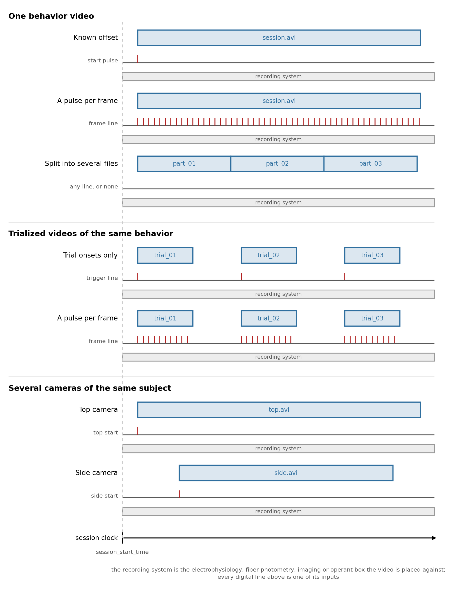
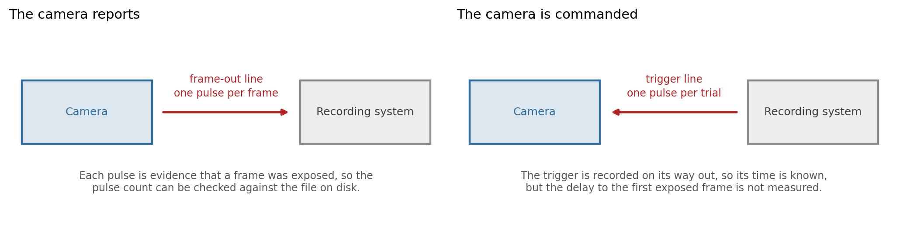

.. _align_external_video:

How to Time Align Behavior Videos to Other Modalities
=====================================================

A camera is its own acquisition system, and it is almost never on the same clock as whatever it is
recording alongside. The times it stamps its frames with are its own, so before any frame can be read
against another signal it has to be expressed on the session clock. That is the job this guide is about.

Most rigs record behavior video alongside something else: extracellular electrophysiology, fiber
photometry, optical imaging, an operant box. The camera is on its own clock in every one of them, so the
recipes below cover those setups together. What changes between them is not which modality the video sits
next to but how the camera's output is chunked and what the cable between the two systems carried.

This guide covers :py:class:`~neuroconv.datainterfaces.behavior.video.externalvideointerface.ExternalVideoInterface`,
which leaves the video on disk and writes an ``ImageSeries`` pointing at it. For the generic
synchronization methods and how they relate to each other, see the
:doc:`temporal alignment user guide <../user_guide/temporal_alignment>`.

What the session produced
-------------------------

Two things: a recording that ran for the whole session, and video that may or may not have. The recording
is the other modality, whichever it is, and it matters here for two reasons. Its clock is normally the
session clock, because everything else in the rig is wired into it. And its digital inputs are where the
camera's timing signal was captured, so it is also the instrument that measures the video.

         files on top, the digital line that timed them below, and a band for the recording system running
         the whole session underneath, since the recording is present in all of them and is what the video
         is placed against. The first group, one behavior video, holds a single long block with one start
         pulse, the same block over a line pulsing continuously, and three blocks touching end to end whose
         line is labelled "any line, or none" because what makes that case its own is the file layout
         rather than the wiring. The second, trialized videos of the same behavior, holds three short
         blocks separated by gaps over a trigger line carrying one pulse at each block's start, and the
         same separated blocks over a line pulsing only while a block runs, so the pulses arrive in three
         bursts. The third, several cameras of the same subject, holds one long block for a top camera and
         a shorter one starting later for a side camera, each over its own line. A dashed guide marks the
         session start time, so the gap before each row's first block is that row's offset.

The video arrives in one of three arrangements, and they are the three sections below. **One behavior
video** is a single camera writing one file, or writing several that are one recording split in place.
**Trialized videos of the same behavior** is a single camera triggered per trial, so one file per trial
with real gaps between them. **Several cameras of the same subject** is not a third arrangement: it is
several cameras, each of which is one of the first two, and each aligned on its own.

How they are wired, and where the times come from
-------------------------------------------------

Between the camera and the recording system there is usually a cable, and which way it points decides how
well you can do. It is the second of the two things that pick a recipe: the arrangement above says how
many placements you have to make, and the cable says how good each one can be.

         only thing that differs between them is the arrow. In "the camera reports" the arrow runs from the
         camera to the recording system, labelled frame-out line, one pulse per frame, with a note that
         each pulse is evidence a frame was exposed so the count can be checked against the file. In "the
         camera is commanded" the arrow runs the other way, from the recording system to the camera,
         labelled trigger line, one pulse per trial, with a note that the trigger is recorded on its way
         out so its time is known but the delay to the first exposed frame is not measured.

**The camera reports.** The camera has a frame-out or strobe pin that fires each time it exposes a frame,
wired into a digital input on the recording system. Every frame therefore has a time measured on the
session clock, which is the best case: it corrects drift, and because a pulse is evidence a frame
happened, the pulse count is a fact you can check the video file against.

**The camera is commanded.** The line runs the other way, from the controller or the recording system into
the camera's trigger input, and the same line is recorded on a digital input so its time is known. What
was measured is the command, not a confirmation, so the delay from trigger to first exposed frame is
unmeasured and nothing in the file records it. Within a trial the frame times then come from the nominal
frame rate rather than from measurement.

**No cable.** Then you have only whatever someone wrote down, a start time and nothing relating the two
clocks after that instant.

Crossing the two gives the recipes, which are the subsections of the three sections below:

.. list-table::
   :header-rows: 1
   :widths: 26 30 44

   * - The video
     - What the line carried
     - Recipe
   * - One file
     - Nothing but a start time
     - :ref:`Known offset <video_known_offset>`
   * - One file
     - A pulse per frame
     - :ref:`A pulse per frame <video_single_pulse_per_frame>`, under one behavior video
   * - Several files, one recording
     - Either
     - :ref:`When the recorder split the session into several files <video_split_files>`
   * - One file per trial
     - An onset per file
     - `Trial onsets only`_
   * - One file per trial
     - A pulse per frame
     - :ref:`A pulse per frame <video_trialized_pulse_per_frame>`, under trialized videos
   * - Several cameras
     - Per camera
     - One of the above for each, in `Several cameras of the same subject`_

One combination is missing from that list and is worth naming: one file per trial with no line at all.
Nothing then says where the trials sit, so the interface falls back on reading them as one recording split
in place, warns that it has done so, and writes a file whose trials run back to back. You would have to
recover the starting times from somewhere else, a behavioral log or the files' modification times, and set
them yourself.

Reading the line
^^^^^^^^^^^^^^^^

Whichever direction it points, the line lands on a digital input of the recording system and is read the
same way. Name it in the header, configure it, and read it back without writing anything:

.. code-block:: python

    from neuroconv.datainterfaces import IntanDigitalInterface, IntanRecordingInterface

    recording_interface = IntanRecordingInterface(file_path="session.rhd")
    digital_interface = IntanDigitalInterface(
        file_path="session.rhd",
        detection_configuration={
            "DIGITAL-IN-02": [
                {
                    "signal_conditioning": {"binarize": "midpoint"},
                    "detection": "rising",
                    "event_name": "camera_frame",
                }
            ]
        },
    )

    frame_pulse_times = digital_interface.get_event_times("camera_frame")

Reading the pulses off the recording system is also what decides the clock. Times measured on an Intan
digital line are on the Intan clock, so the frames you hand them to land there too. That is the session
clock by construction as long as the recording interface is left where it is, which is the usual
arrangement: one system is the master because everything else is wired into it, it is not shifted, and
every other stream is expressed in its clock. If you do move the recording, shift it before you read, so
the pulses come back already carrying the shift.

This is also why no interpolation step appears on this page. Two clocks rarely differ by a constant: they
run at slightly different rates and the difference wanders, and interpolating between paired sync pulses
is how you track that when a handful of pulses is all you have. A frame-out line makes the tracking
unnecessary rather than easier, because each frame's time on the recording clock is then measured, so
however the two clocks drifted apart it is already in those numbers.

``get_event_type_source_ids()`` lists what a configuration resolved to if you are not sure of the handle.
The line you configure is also written to the file as an ``EventsTable``, which is the right outcome: the
pulse train is a record of the experiment and not merely scaffolding. Reading a line and keeping it out of
the conversion are no longer the same decision. How the configuration itself works is
:ref:`extract_events_from_signals`.

Getting that order wrong is silent: pulses read before the shift look entirely reasonable and are wrong by
exactly the offset, with nothing downstream able to detect it. The mirror of the rule applies to the video,
where measured times already place it, so setting them and shifting the interface as well moves it twice.

One behavior video
------------------

One camera, running for the session, writing one file. The interface writes one ``ImageSeries``, and the
only question is what timed it.

.. code-block:: python

    from neuroconv.datainterfaces import ExternalVideoInterface

    interface = ExternalVideoInterface(file_paths=["session.avi"], video_name="BehaviorCamera")
    interface.alignment.keys()
    # ('session',)

Each video file is addressable for alignment under the stem of its path, which for a single video means
one key. Note that a single video writes with no alignment call at all, claiming it started exactly at
``session_start_time``. That is a claim worth checking rather than accepting.

.. _video_known_offset:

Known offset
^^^^^^^^^^^^

All you know is when the camera started relative to the session start.

.. code-block:: python

    interface.alignment.shift_times(12.5)

Frame times come from the video's own frame rate, moved rigidly by the offset. This corrects the start and
nothing else: two clocks that differ by a constant today will differ by more of one an hour from now, so a
long session on a free-running camera accumulates error that no single number can fix.

.. _video_single_pulse_per_frame:

A pulse per frame
^^^^^^^^^^^^^^^^^

The camera sent a pulse on every frame it captured, so the recording system timestamped each frame
directly. This is accurate and corrects drift, so prefer it whenever the pulses exist.

.. code-block:: python

    frame_pulse_times = digital_interface.get_event_times("camera_frame")

    frame_count = interface.get_frame_counts()[0]
    assert len(frame_pulse_times) == frame_count, (
        f"{len(frame_pulse_times)} pulses for {frame_count} frames."
    )

    interface.alignment["session"].set_times(frame_pulse_times)

**Check the count before you set anything.** A mismatch is common, from dropped frames or from a pulse
train that was already running when the camera started, and it is exactly the kind of error that produces
a file that is wrong in a way nothing downstream flags. A pulse count one or two short of the frame count
usually means dropped frames; a count much larger usually means the line was recording before the camera
began, and you want the tail of it.

.. _video_split_files:

When the recorder split the session into several files
^^^^^^^^^^^^^^^^^^^^^^^^^^^^^^^^^^^^^^^^^^^^^^^^^^^^^^

Still one continuous recording, but the software was set to open a new file every few minutes, so it
arrives as several. Each file starts where the one before it ended, and those durations are the frame
counts over the frame rates:

.. code-block:: python

    import numpy as np

    interface = ExternalVideoInterface(file_paths=["part_01.avi", "part_02.avi", "part_03.avi"])

    durations = np.array(interface.get_frame_counts()) / np.array(interface.get_frame_rates())
    starting_times = np.concatenate([[0.0], np.cumsum(durations)[:-1]])

    for segment_key, starting_time in zip(interface.alignment.keys(), starting_times):
        interface.alignment[segment_key].set_starting_time(starting_time)

    interface.alignment.shift_times(12.5)

Strictly you can skip that loop, because it is what the interface assumes anyway. **But it warns when it
has to assume**, naming the files with no times of their own, and the loop is how you silence it. That is
deliberate: a rotated recording and a camera triggered once per trial produce the same list of files, and
nothing in the files tells them apart, so writing the first reading without saying so would hide a wrong
answer. A rigid ``shift_times`` does not silence it either, since it moves the whole interface and says
nothing about any one file.

.. note::

   Writing the cumulative durations asserts that the recorder dropped no frames between closing one file
   and opening the next. That is usually close enough over a few minutes and it is the best the files
   themselves can tell you, but it is an assumption; a frame-out line, if the rig has one, measures it
   instead.

Trialized videos of the same behavior
-------------------------------------

One camera again, but a pulse triggers it at the start of each trial, so the session yields one file per
trial with real gaps between them. Each file's placement is an independent fact.

``ExternalVideoInterface(file_paths=[...])`` writes a **single** ``ImageSeries`` whose ``external_file``
list is as long as the input. A session of forty trials is one container with forty entries, not forty
containers. Modelling it as one interface per trial gives a file that is harder to consume, because
nothing downstream can tell that the forty series are one camera. ``starting_frame``, which marks where
each external file begins within the series, is computed from the frame counts and never appears in your
code.

.. code-block:: python

    interface = ExternalVideoInterface(file_paths=["trial_01.avi", "trial_02.avi", "trial_03.avi"])
    interface.alignment.keys()
    # ('trial_01', 'trial_02', 'trial_03')

If two trials write files with the same name in different folders, rename them. The stem is how a file is
addressed, so it has to be unique, and the interface raises at construction rather than silently merging
two handles.

Trial onsets only
^^^^^^^^^^^^^^^^^

The digital line recorded the triggers and nothing else.

.. code-block:: python

    trial_onsets = digital_interface.get_event_times("camera_trigger")
    segment_keys = interface.alignment.keys()
    assert len(trial_onsets) == len(segment_keys)

    for segment_key, onset in zip(segment_keys, trial_onsets):
        interface.alignment[segment_key].set_starting_time(onset)

Each file is placed where its trigger fired, and within a file the frame times come from the nominal frame
rate. So the no-drift caveat from the known-offset case returns, but per trial rather than once for the
session, which is usually fine: a trial is short, and a camera does not drift far in ten seconds.

``set_starting_time`` is **absolute**, so calling it twice puts the file where the second call says
rather than moving it twice, which is what distinguishes it from ``alignment.shift_times``.

Within a file the frame times come from the frame rate the container states, which is a header read rather
than a decode. For variable-frame-rate footage that rate is a fiction, and there the file does carry a time
per frame; ``get_original_timestamps()`` decodes them, one array per file, each starting near zero. It is a
full pass over every frame, so it is not what the write path does by default, but where you need it:

.. code-block:: python

    frame_times = interface.get_original_timestamps()

    for segment_key, onset, times in zip(segment_keys, trial_onsets, frame_times):
        interface.alignment[segment_key].set_times(onset + times)

.. _video_trialized_pulse_per_frame:

A pulse per frame
^^^^^^^^^^^^^^^^^

The richest case, and the one to ask for when a rig is being designed. A frame-out line that is active only
while the camera is running gives you both structures at once, because the pulses arrive in bursts, one
burst per trial: the burst onsets are where the files start, and the pulses within a burst are the frame
times of that file.

.. code-block:: python

    import numpy as np

    frame_pulse_times = digital_interface.get_event_times("camera_frame")

    # The gap between trials is far larger than the frame interval, so the split is unambiguous.
    frame_interval = np.median(np.diff(frame_pulse_times))
    gap_indices = np.flatnonzero(np.diff(frame_pulse_times) > 10 * frame_interval) + 1
    bursts = np.split(frame_pulse_times, gap_indices)

    segment_keys = interface.alignment.keys()
    frame_counts = interface.get_frame_counts()

    assert len(bursts) == len(segment_keys), f"{len(bursts)} bursts for {len(segment_keys)} files."
    for segment_key, burst, frame_count in zip(segment_keys, bursts, frame_counts):
        assert len(burst) == frame_count, f"{segment_key}: {len(burst)} pulses for {frame_count} frames."
        interface.alignment[segment_key].set_times(burst)

Those two assertions are the point of this section. Once the pulse train has to agree with the files both
in how many trials it saw and in how long each one was, it has stopped being a source of numbers and become
a check on the conversion.

**A second line makes the split more robust.** If the rig also has a line marking when each trial began,
bin the frame pulses between consecutive trial onsets instead of splitting on the gaps. It needs no
threshold, and a trial that recorded no frames comes back as an empty burst, which the frame-count
assertion then catches, rather than being silently merged into its neighbour.

.. code-block:: python

    trial_onsets = digital_interface.get_event_times("camera_trigger")
    bursts = np.split(frame_pulse_times, np.searchsorted(frame_pulse_times, trial_onsets[1:]))

One case this does not cover: a camera that free-runs while only some of its frames are written to disk.
The counts no longer say which frames were saved, so neither the gaps nor the onsets can reconstruct the
mapping, and no alignment recipe repairs it. That one needs per-frame metadata from the acquisition
software.

Several cameras of the same subject
-----------------------------------

A top view and a side view, or a face camera and a body camera, recording the same subject at the same
time. **This is not a third shape.** Each camera is its own acquisition system with its own clock, so each
gets its own interface, its own ``ImageSeries``, its own camera device, and its own alignment, and each one
is then whichever of the cases above fits it.

.. code-block:: python

    from neuroconv import NWBConverter

    class BehaviorConverter(NWBConverter):
        data_interface_classes = dict(
            TopCamera=ExternalVideoInterface,
            SideCamera=ExternalVideoInterface,
            Recording=IntanRecordingInterface,
            Digital=IntanDigitalInterface,
        )

    converter = BehaviorConverter(
        source_data=dict(
            TopCamera=dict(file_paths=["top.avi"], metadata_key="top_camera"),
            SideCamera=dict(file_paths=["side.avi"], metadata_key="side_camera"),
            Recording=dict(file_path="session.rhd"),
            Digital=dict(file_path="session.rhd", detection_configuration=detection_configuration),
        )
    )

Give each camera its own ``metadata_key``. It is the address of that camera's entry in
``metadata["Behavior"]["ExternalVideos"]``, it keeps the two ``ImageSeries`` and their devices apart, and
it is what a ``PoseEstimation`` container names when it says which video its keypoints were tracked from
(see :ref:`annotate_pose_metadata`).

Then align each camera from the line that timed it:

.. code-block:: python

    digital_interface = converter.data_interface_objects["Digital"]
    top_camera = converter.data_interface_objects["TopCamera"]
    side_camera = converter.data_interface_objects["SideCamera"]

    top_camera.alignment["top"].set_times(digital_interface.get_event_times("top_frame"))
    side_camera.alignment["side"].set_times(digital_interface.get_event_times("side_frame"))

Two cameras started by one trigger still drift apart, because each free-runs on its own oscillator after
that trigger. So one shift applied to both is only correct if both are genuinely slaved to the same clock;
where each has its own frame-out line, use it, and where only one does, do not borrow its times for the
other.

Limitations
-----------

A single ``ImageSeries`` with several ``external_file`` entries has no per-file timing metadata. The trial
structure survives in the concatenated ``timestamps`` and in ``starting_frame``, from which the per-file
frame counts can be recovered, but there is no field that says "file 2 covers trial 2 and ran from here to
here", and a single file within the series cannot be addressed on its own. This is a known limitation of
the schema, tracked in `nwb-schema#677 <https://github.com/NeurodataWithoutBorders/nwb-schema/issues/677>`_.

So do not try to make the ``ImageSeries`` carry the trial structure. **The trials table is where that
lives**: write one row per trial with its start and stop time, and the video frames fall inside those
intervals because you aligned them. See :ref:`adding_trials` for how to add it.
