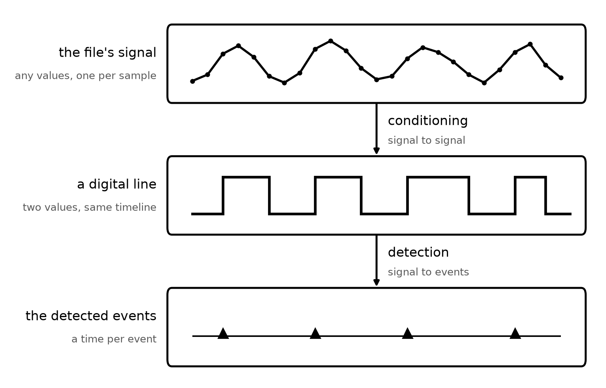
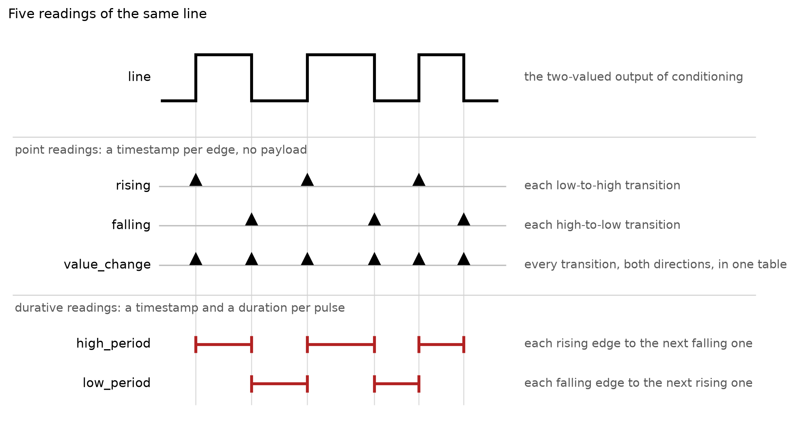
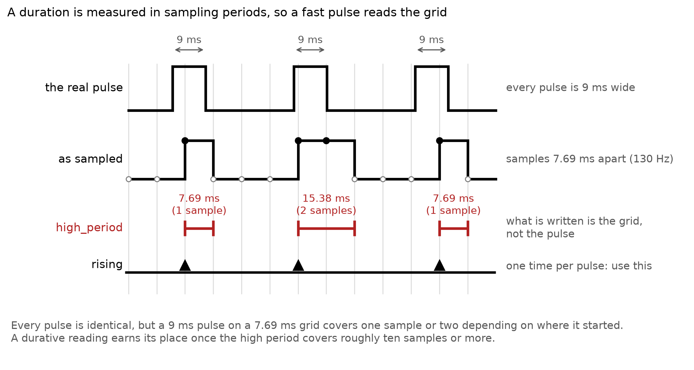

.. _extract_events_from_signals:

How to Extract Events from a Sampled Signal
===========================================

Some formats hand you events already extracted: a TDT epoc store, a Spike2 marker channel, a CSV of
timestamps. Others record the events as a **signal**, a sampled trace you have to read: a TTL line
packed into a digital word, a photodiode wired into an analog input, a camera's frame-out pulse. This
guide is how you specify the extraction for that second kind. It is an explanation of
``detection_configuration``, the argument the signal-encoded events interfaces take: which signals are
read, how each one becomes a line, and which of its transitions become events.

What those events are then called and how they are laid out in the file is a separate job, the editable
events metadata, covered in :ref:`annotate_events_metadata`.

The event detection model
-------------------------

Every event type is read in two stages, and each detection spec states both.

**Conditioning** turns whatever the file carries into a **line**: a two-valued signal, the same length
as the original and on the same timeline. **Detection** then reads that line's transitions as events.
The boundary between the two is where the data type changes: conditioning is signal to signal,
detection is signal to events.

That conditioning always returns a two-valued signal is the contract the rest of the grammar rests on.
It is why the readings below need no threshold of their own, and why an edge is simply a transition
from the lower value to the higher one.

         signal, holds a sampled trace with two humps, captioned "any values, one per sample". An arrow
         labelled "conditioning, signal to signal" leads to the middle box, a digital line, holding a square
         wave that is high across each hump, captioned "two values, same timeline". An arrow labelled
         "detection, signal to events" leads to the bottom box, the detected events, holding a marker at
         each of the line's rising edges, captioned "a time per event".

Both routes land on the same thing, which is why the reading vocabulary is the same whatever the signal
was.

You can watch the model run without writing a file. ``get_event_type_source_ids()`` lists the event
types a configuration resolves to and ``get_event_times(event_type_source_id)`` hands back one type's
times, which is the quickest way to find out that a cut sits on the wrong side of the noise, or that a
line you expected to fire never toggled.

.. _events_conditioning:

Conditioning: how a signal becomes a line
^^^^^^^^^^^^^^^^^^^^^^^^^^^^^^^^^^^^^^^^^

There are exactly two ways to get there, and which one is legal is decided by the signal rather than by
you.

``bits``
    For a **packed word**, an integer whose bits are separate wires. ``{"bits": [3]}`` selects bit
    position 3 and gives you that wire's ``0``/``1`` line. Name one bit per spec: reading several bits
    together as one coded value needs a strobe or debounce guard to know when the word has settled,
    and the two will land together.

    The line follows the wire and never the size of the word, which is also why a word cannot be cut
    with ``binarize``: its value is several signals at once rather than a magnitude.

    .. image:: ../_static/images/events_conditioning_bits.png
       :width: 640px
       :alt: A packed word drawn as a grid of bit cells, four bits by six samples, with the word values
             13, 15, 15, 11, 9 and 1 above it and the bit 1 row boxed in red. Below, the line that row
             gives, reading 0, 1, 1, 1, 0, 0. A note points out that 9 is bigger than 1 but bit 1 is 0
             in both, so the line is low across the pair.

``binarize``
    For a **magnitude**. It does two jobs that are worth telling apart:

    - ``{"binarize": 550.0}`` cuts an analog trace at a level you give. This is the case of a TTL
      wired into an analog input, or a photodiode whose trace you want thresholded.
    - ``{"binarize": "midpoint"}`` cuts at ``(min + max) / 2``, derived from the data. This is for a
      signal that is **already two-valued**, whatever those two values are: a TTL riding between 0 and
      5, a line arriving as 0 and 1, a ``uint16`` line at 0 and 65535. The derived cut falls strictly
      between the two levels, so you do not have to know them. On a genuinely analog trace it is not
      the right tool, since ``min`` and ``max`` are then whatever extremes the recording happened to
      reach and one noise spike moves the cut. Give a number there.

    .. image:: ../_static/images/events_conditioning_binarize.png
       :width: 640px
       :alt: An analog trace of six samples, 480, 510, 700, 690, 505 and 660, with a dashed red cut line
             at 550 across it. Below, the line the cut gives, reading 0, 0, 1, 1, 0, 1.

**Every spec states its conditioning; there is no default.** A spec is all-or-nothing, so a half-filled
one is an error rather than a silent fallback, and what an event type was read from is always something
you chose. A signal that is already a line still says so, with ``{"binarize": "midpoint"}``.

.. _events_detection:

Detection: how a line becomes events
^^^^^^^^^^^^^^^^^^^^^^^^^^^^^^^^^^^^

Five readings, in two families.

         point readings, drawn as triangle markers: rising at each low-to-high transition, falling at each
         high-to-low one, and value_change at every transition in both directions. Grouped below are the
         durative readings, drawn as horizontal spans: high_period from each rising edge to the next falling
         one, and low_period from each falling edge to the next rising one.

``rising`` and ``falling`` write a timestamp per edge. ``high_period`` and ``low_period`` write a
timestamp and a duration per pulse, and are lossless in the sense that every transition is preserved;
``low_period`` is the one to reach for on an active-low line. ``value_change`` is ``rising`` and
``falling`` pooled into a single table rather than two, and carries no payload.

A durative reading whose last event has no closing edge in the recording writes a ``NaN`` duration, for
an interval the recording truncated.

A spec states exactly one of the two. A signal with more than two levels is read by writing one spec per
distinction, on the same signal, which is also how one digital word becomes many event types, one spec
per bit.

The ``detection_configuration`` argument
^^^^^^^^^^^^^^^^^^^^^^^^^^^^^^^^^^^^^^^^

The pipeline above is formally described by the ``detection_configuration`` argument. It is keyed by
signal, and each signal holds a **list** of specs, one per event type you want derived from it:

.. code-block:: python

    detection_configuration = {
        "<signal_source_id>": [
            {
                "signal_conditioning": {...},            # stage one: how this signal becomes a line
                "detection": "<reading>",                # stage two: which transitions become events
                "event_name": "<your name>",             # optional
            },
            # more specs on the same signal, one per event type derived from it
        ],
        # more signals
    }

The key is the signal's own handle, the name the file gives it: ``"XD0"`` or ``"XA3"`` on a SpikeGLX
NIDQ board, ``"DIGITAL-IN-01"`` on an Intan header. Construct the interface with no configuration and
read ``get_metadata()`` to see which handles your own file offers. Its value is always a list, even for
one spec, because one signal may yield several event types.

``signal_conditioning`` is required, and controls how this signal is conditioned into a line
(:ref:`illustrated above <events_conditioning>`). It holds exactly one of:

- ``{"bits": [n]}``, one wire selected out of a packed word
- ``{"binarize": <number>}``, a magnitude cut at the level you give
- ``{"binarize": "midpoint"}``, an already two-valued signal cut between its two levels

``detection`` is required, and controls which of that line's transitions become events
(:ref:`illustrated above <events_detection>`). It is one of:

- ``"rising"``, a time at each low-to-high transition
- ``"falling"``, a time at each high-to-low transition
- ``"value_change"``, both directions pooled into one table
- ``"high_period"``, each rising edge to the next falling one, with a duration
- ``"low_period"``, each falling edge to the next rising one, with a duration

``event_name`` is optional. It is the handle the events metadata is keyed by, so it is what you address
to name an event type, describe it, or route it into a shared table. See
:ref:`annotate_events_metadata`.

Four worked shapes
------------------

Every configuration is one of these four, whatever the format. Your format's gallery page has the
channel names and a runnable example.

**A packed digital word.** SpikeGLX NIDQ carries sixteen TTL lines in a single ``XD`` word:

.. code-block:: python

    detection_configuration = {
        "XD0": [
            {
                "signal_conditioning": {"bits": [0]},
                "detection": "rising",
                "event_name": "trial_start",
            },
            {
                "signal_conditioning": {"bits": [1]},
                "detection": "high_period",
                "event_name": "reward_window",
            },
        ],
    }

**A signal that already is a line.** An Intan digital input is addressed by the header's own name and
needs no threshold, only the assertion that it is already two-valued:

.. code-block:: python

    detection_configuration = {
        "DIGITAL-IN-01": [
            {
                "signal_conditioning": {"binarize": "midpoint"},
                "detection": "rising",
                "event_name": "camera_sync",
            },
        ],
    }

**An analog trace cut at a level.** A TTL wired into an analog input, which is a common way to get more
lines out of a board:

.. code-block:: python

    detection_configuration = {
        "XA3": [
            {
                # the cut is in the signal's stored values, not in volts
                "signal_conditioning": {"binarize": 550.0},
                "detection": "rising",
                "event_name": "stimulus_onset",
            },
        ],
    }

**One signal read two ways.** Both edges of the same line, as two event types:

.. code-block:: python

    detection_configuration = {
        "DIGITAL-IN-02": [
            {
                "signal_conditioning": {"binarize": "midpoint"},
                "detection": "rising",
                "event_name": "lever_press",
            },
            {
                "signal_conditioning": {"binarize": "midpoint"},
                "detection": "falling",
                "event_name": "lever_release",
            },
        ],
    }

Every spec above sets an ``event_name``. It is optional, but worth writing by default.

**The identifier your event type gets is what the events metadata is keyed by.** An ``event_name``
becomes that identifier directly. Leave it out and the identifier is derived instead: the signal's own
handle when it is the signal's only spec, or the handle plus its distinguishing components when there
are several, giving ``XD0_bit0_rising`` or ``DIGITAL-IN-02_rising``. Derived identifiers move when the
configuration changes, so adding a second spec to a signal renames the first one and any metadata keyed
by the old name stops addressing it. Whichever way they are arrived at, identifiers must be unique
across the configuration, and an ``event_name`` is required outright when several specs on one signal
cut at numbers, as a cut point does not stringify into a stable name.

Doing the detection yourself
----------------------------

``detection_configuration`` cannot always express how your signal becomes your events. A configuration
states parameters, so anything that needs an algorithm is out of its reach:

- hysteresis or a Schmitt trigger, for a trace that chatters across the cut
- debouncing a mechanical contact
- an adaptive or drifting threshold, or one derived per trial
- peak detection, template matching, or anything reading the trace's history

Configure what the grammar can express, take those times out, refine them in your own code, and write
the result with the pynwb API directly. Build the file with the interface, add your own
``EventsTable`` to it, and write it:

.. code-block:: python

    from pynwb.event import EventsTable

    from neuroconv.tools.nwb_helpers import configure_and_write_nwbfile

    # Everything the interface can do on its own, including writing the raw trace.
    nwbfile = interface.create_nwbfile(metadata=metadata)

    # The times the configuration resolved to, refined however you need.
    times = interface.get_event_times("lever_press")
    onsets, durations = your_event_detection_pipeline(times)

    # Your own table, added to the same file.
    table = EventsTable(name="LeverPresses", description="Lever presses, from your own detection.")
    for onset, duration in zip(onsets, durations):
        # check_ragged=False keeps the fill linear: without it hdmf rescans the whole column on
        # every add_row, and every value here is a scalar so the check can only answer False.
        table.add_row(timestamp=onset, duration=duration, check_ragged=False)
    nwbfile.add_events_table(table)

    configure_and_write_nwbfile(nwbfile, nwbfile_path="session.nwb")

``add_events_table`` puts the table in ``nwbfile.events``, which is where the events interfaces write
too, so a file assembled this way is the same shape as one written entirely by NeuroConv.

Limitations and gotchas
-----------------------

**A configuration is a selection, so it drops the signals it does not name.** Passing none
(``detection_configuration=None``, the default) derives every signal the file's header declares, each
with the interface's default reading. Passing one gives you only what you named, and nothing warns
about the rest, as naming a subset is the ordinary way to avoid writing empty tables for lines nothing
was wired to. Either name every signal you want and keep that list current with your rig, or name none
and accept some empty tables. Mixing the two is what loses a line. An empty configuration, ``{}``,
raises instead of writing nothing, as selecting nothing is normally a mistake.

**Cut points are in stored values, not in volts.** At the moment a ``binarize`` cut is compared against
the numbers the file holds. The companion ``TimeSeries`` written for the same channel declares its
physical unit and a conversion factor, so the two numbers differ. Read the traces off the interface's
extractor to see the values your cut is compared against.

**A duration can be the sampling grid instead of the pulse.**
``high_period`` and ``low_period`` measure a duration in sampling periods, so they are ill-defined when
the sampling rate is too low for the pulse. A 130 Hz line samples every 7.69 ms, so a camera's frame-out
pulse covers one sample or two depending on where it started, and its duration reads 7.69 ms or 15.38 ms
though every pulse is identical. What gets written there is the sampling grid, not the pulse.

         sampled at 130 Hz, where one pulse covers one sample and the next covers two. The high_period
         spans read 7.69 ms, 15.38 ms and 7.69 ms for pulses that are all identical. The rising row gives
         one time per pulse.

Use ``rising`` on such a line. A durative reading earns its place once the high period covers roughly
ten samples or more, a trial gate or a lever hold, where one sample of quantization is a small fraction
of the real duration.
