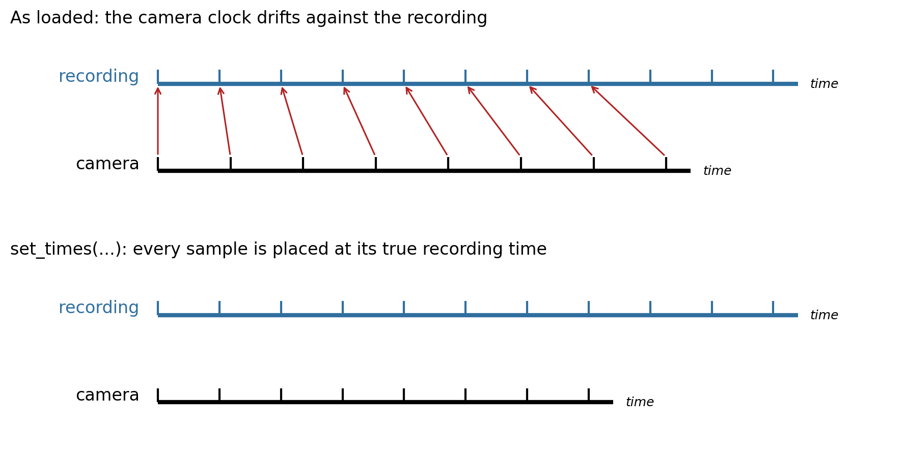
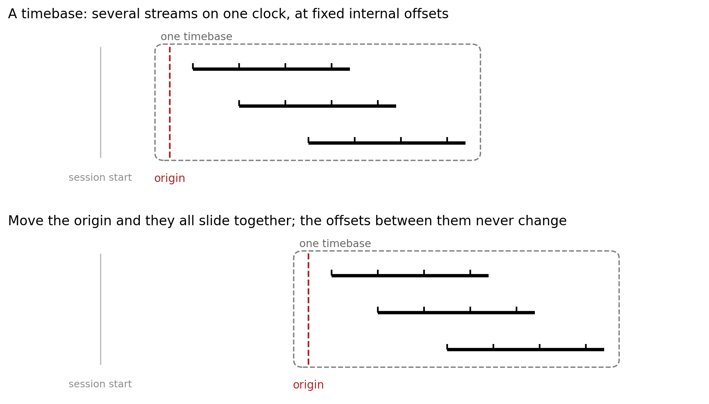
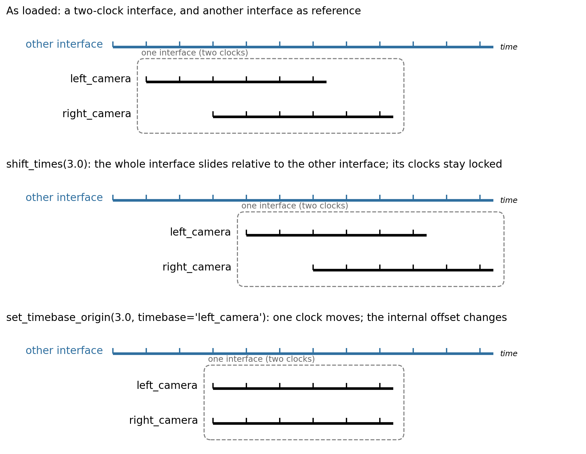

Temporal Alignment
==================

.. admonition:: Draft, proposed API, not yet implemented
   :class: warning

   This page is a design draft for NeuroConv's temporal-alignment API, shared for feedback. The methods it
   describes (``shift_times``, ``set_timebase_origin``, ``set_times``, ``get_times``, ``get_timebase_origin``,
   ``timebases``) are proposed and are not yet in the library; their names and behavior may still change.

Neurophysiology experiments often combine several acquisition systems, and each system keeps its own clock. A
conversion has to express all of their timings on one shared clock. NeuroConv is deliberately agnostic about what the
correct timestamps are: it does not try to infer them for you, because only you know how your systems were wired and
synchronized. What it provides is a small set of methods that let you *set* the timing of each stream so that it fits
the model PyNWB expects.

That model is simple: every time stored in an NWB file is measured from a single ``session_start_time``. When the
source carries timing information, the interface pre-loads it from the acquisition system, so you begin with the times
that system actually recorded. Those times are usually local to that acquisition system, though, and its clock need not
coincide with the global clock of your experimental session. By default the interface writes them unchanged, which
amounts to assuming the two clocks coincide; when they do not, aligning the stream is how you declare where the
acquisition clock actually sits. NeuroConv never resamples or changes the data values; it only sets the timing of the
samples you already have.

Two modes of alignment
----------------------

There are two fundamentally different situations, and they use different methods.

**Coarse alignment** positions a whole stream on the shared clock without touching its internal structure. The samples
are already correctly spaced relative to one another; the only unknown is the stream's overall offset. Because coarse
alignment is a rigid translation, it preserves every interval within the stream. This is what most conversions need,
and ``shift_times`` applies the offset.

**Fine alignment** rewrites the per-sample timing, because a single offset is not enough: the samples are not where a
rigid shift would put them. This happens when two clocks drift relative to each other, or when the true time of each
sample is only recoverable from a synchronization signal recorded on the primary system. The method is ``set_times``.

.. list-table::
   :header-rows: 1
   :widths: 30 14 56

   * - Method
     - Mode
     - What it does
   * - ``shift_times(delta)``
     - coarse
     - Move the whole stream by ``delta`` seconds.
   * - ``set_times(times)``
     - fine
     - Replace the stream's sample times outright.

Coarse alignment
----------------

Use ``shift_times`` when you know a stream is *offset* from another by a known amount, for example a secondary system
that sends a single pulse to the primary system as it powers on. The pulse gives the offset, and you move the whole
stream by it. ``shift_times`` is a rigid translation, so it preserves the stream's internal structure exactly, and
because it is relative, calling it twice shifts twice.

.. code-block:: python

    camera_interface.shift_times(3.0)  # this stream's data now sits 3.0 seconds later on the shared clock

.. image:: ../_static/images/time_alignment_coarse.png
   :alt: Coarse alignment: a camera stream slides as a rigid block onto the recording clock, its sample spacing intact.
   :width: 600px
   :align: center

Fine alignment
--------------

When a single offset is not enough, replace the timestamps directly with ``set_times``. This corrects for a difference
in starting time and for any drift between the clocks. The usual source of these timestamps is a synchronization signal
sent from the secondary system to the primary one on every sample, for example a TTL (transistor-transistor logic)
pulse emitted by an imaging camera each time a frame is captured. You set the stream's times to those pulse times as
received by the primary system.

.. code-block:: python

    camera_interface.set_times(per_sample_aligned_timestamps)  # each sample's true time on the session clock

Alignment across modalities
---------------------------

Most interfaces write a ``TimeSeries``, or a container built on one, where the timestamps form a single axis. This
covers electrophysiology (an ``ElectricalSeries``), optical imaging (a ``TwoPhotonSeries`` or the fluorescence traces
derived from it), and pose estimation (a ``PoseEstimationSeries``, one timestamp per tracked frame). Both modes apply
to these: ``shift_times`` for coarse alignment and ``set_times`` for fine.

Other interfaces carry no timestamps stream to rewrite. A trials or epochs table holds a start and a stop per row, and
an events interface holds a timestamp, sometimes with a duration, per event, so there is no single sample axis for
``set_times`` to operate on. These accept only ``shift_times`` at the moment, which is usually all they need. A
behavioral events interface, for example, reads its event times on the acquisition box's own clock; a single
``shift_times`` moves every event onto the session clock at once, as one rigid block.

.. code-block:: python

    events_interface.shift_times(events_offset)  # every event time slides onto the session clock together

Pose estimation makes a useful bridge to the next idea. From a single camera it is just one more timestamps stream, one
clock like any other. But when pose is tracked from several cameras that were not hardware-synchronized, one interface
ends up carrying several independent clocks at once, and placing them is no longer a single shift. That is what
timebases are for.

Timebases: origins and multiple clocks
--------------------------------------

Everything above works through one underlying idea. Alignment operates on a **timebase**: one clock together with
everything whose times are coordinates in it. Two things share a timebase when aligning one necessarily aligns the
other, so the samples of a single recording are one timebase, and ``shift_times`` moves it as a whole.

A timebase has one piece of alignment state, its **origin**: where its clock's zero sits on the shared session clock.
The origin starts at zero, meaning native times are written unchanged, and aligning a stream is nothing more than
moving that origin. Native times are never mutated; the origin is a transform applied on top of them.

Placing a clock at a known time
~~~~~~~~~~~~~~~~~~~~~~~~~~~~~~~~~

``shift_times`` moves a clock by a relative amount. When you instead know the *absolute* position of a clock, use
``set_timebase_origin``, which places its zero at the given time: ``set_timebase_origin(0.0)`` writes the native times
unchanged, and any other value declares where the clock begins relative to ``session_start_time``. Unlike
``shift_times``, it is idempotent, calling it twice with the same value leaves the stream where the first call put it,
which is what makes it the safer choice inside a converter that may run more than once. ``get_timebase_origin`` reads
the current origin back.

.. code-block:: python

    camera_interface.set_timebase_origin(3.0)   # this clock starts 3.0 seconds after session_start_time
    camera_interface.get_timebase_origin()      # -> 3.0

.. _multiple-timebases:

Interfaces that carry more than one clock
~~~~~~~~~~~~~~~~~~~~~~~~~~~~~~~~~~~~~~~~~~~

Take the multi-camera pose case from the previous section: two cameras filming the same session, each captured on its
own hardware and so keeping its own clock. Aligning one camera does not align the other, so a single interface object
carries two independent clocks, and it lists them by name:

.. code-block:: python

    camera_interface.timebases   # e.g. ["left_camera", "right_camera"]

The two modes of alignment now act at two different scales, and this is the distinction to keep clear.

**shift_times moves the whole interface.** It takes no ``timebase`` and displaces every clock the interface holds by
the same amount, so it preserves the offsets *between* them. Use it to position the interface as a whole relative to
the other interfaces in the session: its internal structure is already correct, and only its overall placement on the
shared clock is unknown.

.. code-block:: python

    camera_interface.shift_times(3.0)   # both cameras move 3.0 s later; they stay exactly as far apart as before

**The per-clock methods act on one named timebase.** ``set_timebase_origin`` and ``set_times`` change a single clock,
which by definition changes where it sits relative to the others, so they require you to name the clock. This is how
you correct one clock against another *within* the interface. Calling a per-clock method without a ``timebase`` raises
rather than guessing which clock you meant.

.. code-block:: python

    camera_interface.set_timebase_origin(3.0, timebase="left_camera")   # position the left camera's clock alone
    camera_interface.get_times(timebase="right_camera")                 # materialize the right camera's clock
    camera_interface.get_times()                                        # raises: which clock?

So the rule of thumb is: ``shift_times`` for placing the whole interface among the others (a rigid move that keeps its
clocks locked together), and the per-clock methods for adjusting one of its clocks against the rest.

Alignment in a converter
------------------------

A converter is where alignment across interfaces comes together: it holds several interfaces and places each on the
shared session clock. Override :py:meth:`.NWBConverter.temporally_align_data_interfaces` to do this. For example, once
you know where an audio stream begins relative to a simultaneously recorded electrophysiology stream, you place it on
the shared clock:

.. code-block:: python

    from neuroconv import NWBConverter
    from neuroconv.datainterfaces import (
        SpikeGLXRecordingInterface,
        AudioInterface,
    )

    class ExampleNWBConverter(NWBConverter):
        data_interface_classes = dict(
            SpikeGLXRecording=SpikeGLXRecordingInterface,
            Audio=AudioInterface,
        )

        def temporally_align_data_interfaces(self):
            audio_interface = self.data_interface_objects["Audio"]
            audio_start_time = ...  # the audio stream's start on the shared clock, however you obtain it
            audio_interface.set_timebase_origin(audio_start_time)

Because ``set_timebase_origin`` is idempotent, re-running the alignment leaves the streams where they were, so the
converter step is safe to call more than once.
