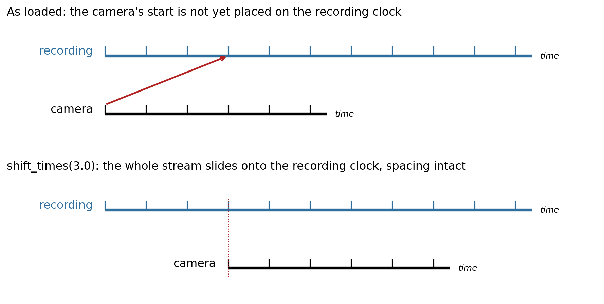
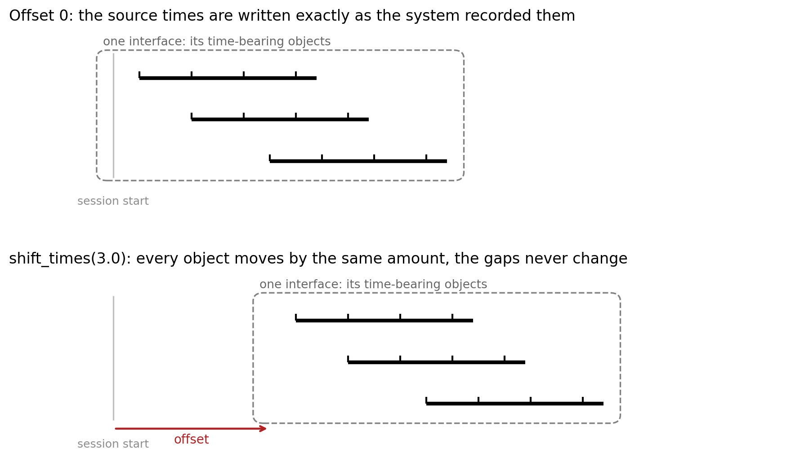

Temporal Alignment
==================

Neurophysiology experiments often combine several acquisition systems, and each system keeps its own clock. A
conversion has to express all of their timings on one shared clock. NeuroConv is deliberately agnostic about what the
correct timestamps are: it does not try to infer them for you, because only you know how your systems were wired and
synchronized. What it provides is a small set of methods that let you *set* the timing of your data so that it fits
the model PyNWB expects.

That model is simple: every time stored in an NWB file is measured from a single ``session_start_time``. When the
source carries timing information, the interface pre-loads it from the acquisition system, so you begin with the times
that system actually recorded. Those times are local to that acquisition system, though, and its clock need not
coincide with the clock of your experimental session. By default the interface writes them unchanged, which amounts to
assuming the two coincide; when they do not, aligning is how you declare where those times actually belong. NeuroConv
never resamples or changes the data values; it only sets the timing of the samples you already have.

Time-bearing objects and the offset
-----------------------------------

Alignment acts on **time-bearing objects**: the objects an interface writes that carry a time coordinate relative to
``session_start_time``. In a recording interface that is the ``ElectricalSeries``; the ``Device``, the ``electrodes``
table, and the ``ElectrodeGroup`` objects have no time and are untouched. In an events interface it is every
``EventsTable``. A ``PoseEstimationSeries`` is one, and so is a ``TimeIntervals`` (trials) table.

Each of them carries an **offset**, in seconds::

    output_time = native_time + offset

Every offset starts at ``0.0``, which is the identity: the source times are written exactly as the acquisition system
recorded them. Aligning is nothing more than changing offsets, and they are applied when the data is written, so the
times held in memory stay in the source clock.

Note what this deliberately does *not* claim: it says only that these objects have times, not that they share a clock
with each other or with anything else. Whether two things are co-timed is up to you and your rig, and you express it
by the offsets you set.

Two kinds of alignment
----------------------

Two different things can be wrong with a stream's timing, and they need different tools.

**Gross alignment.** The samples are correctly spaced relative to one another, and only the placement of the stream as
a whole on the shared clock is unknown. Fixing it is a rigid translation: every interval inside the stream survives
untouched. ``shift_times`` and ``set_offset`` do this, and it is what most conversions need.

**Fine alignment.** The internal structure itself is wrong. Two clocks running at slightly different rates drift apart
over a session, so no single offset can be right for both the first sample and the last; the per-sample times have to
be rewritten, usually from a synchronization signal. ``set_times`` does this.

A quick test for which one you have: if sliding the stream can make it right, it is gross. If sliding it makes the
beginning right and the end wrong, it is fine.

Gross alignment with ``shift_times``
------------------------------------

``shift_times(delta)`` moves **every time-bearing object in the interface** by ``delta`` seconds. It is a rigid
translation: the spacing between samples, the gaps between events, and every duration are all preserved, only the
position on the shared clock changes. It is relative, so repeated calls accumulate.

.. code-block:: python

    events_interface.shift_times(3.0)   # every event now sits 3.0 seconds later on the session clock

This is what most conversions need. The canonical case is a secondary system that sends a single pulse to the primary
system as it starts: that pulse tells you the offset, and one call moves the whole stream onto the shared clock.

Because the move is rigid, an interface holding several time-bearing objects keeps their relationships exactly: they
all slide together by the same amount.

``shift_times`` is the only method that needs no further information: because it adds the *same* delta to every
offset, it can safely apply to everything the interface holds. Every other operation changes one object relative to
the others, so it has to say which one, which means first knowing what there is to address.

Which times actually move
-------------------------

Identifying the times inside an object is per neurodata type, not a single naming rule:

* Well-known types are handled by type: a ``TimeSeries`` moves its ``timestamps`` or ``starting_time``, a ``Units``
  table its ``spike_times`` and ``obs_intervals``, an ``EventsTable`` its ``timestamp`` column.
* A generic ``DynamicTable`` (a trials or epochs table, or your own) follows the NWB convention that columns ending in
  ``_time`` hold times relative to ``session_start_time``, so ``start_time``, ``stop_time`` and any custom
  ``reward_time`` all move together.
* **Durations never move.** A duration is a difference between two times, so a rigid shift leaves it unchanged.

Note that the ``_time`` convention alone is not sufficient, which is why the well-known types carry their own rules:
``spike_times`` is a time but does not end in ``_time``.

Addressing individual objects
-----------------------------

Everything above moves an interface as a whole. To reach one object, ask the interface what it holds:

.. code-block:: python

    pose_interface.time_bearing_objects   # e.g. ("nose", "left_ear", "tail_base")
    events_interface.time_bearing_objects # e.g. ("port_entry", "reward")

Each key names one time-bearing object, and the per-object methods below take it. When an interface holds exactly one
object the key can be omitted; when it holds several, omitting it raises rather than guessing which you meant.

That rule is not arbitrary. ``shift_times`` may default to everything because it is rigid: adding one delta to every
offset leaves the objects in exactly the same relation to one another. An operation that sets a value, rather than
adding one, does not have that property, giving every object the *same* absolute offset would collapse the differences
between them, which is precisely the internal structure you wanted to keep. So anything that sets must name its target.

Setting the offset directly
---------------------------

``shift_times`` moves by a *relative* amount. When you instead know where one object's times should sit, set its
offset outright:

.. code-block:: python

    pose_interface.set_offset(3.0, key="nose")   # written as native + 3.0, whatever the offset was before
    pose_interface.get_offset(key="nose")        # -> 3.0

    single_object_interface.set_offset(3.0)      # key optional when there is only one object

The difference from ``shift_times`` matters when an alignment step runs more than once. ``shift_times`` accumulates, so
calling it twice adds twice; ``set_offset`` is absolute, so calling it twice with the same value leaves the object
exactly where the first call put it. Use ``set_offset`` when you know where something belongs and the step may be
re-run, and ``shift_times`` for a correction you want to *add* on top of an existing alignment, a known cable or
trigger latency, say. ``set_offset(0.0)`` restores an object's source times.

Setting timestamps
------------------

A single offset is not always enough. When two clocks drift relative to one another, later samples are progressively
wrong and no rigid shift can fix them, the per-sample times have to be rewritten. For an object whose times are a
single array, set them directly:

.. code-block:: python

    imaging_interface.set_times(frame_times, key="frames")   # replace one object's times
    imaging_interface.get_times(key="frames")                # read them back, offset applied

The usual source of those times is a synchronization signal recorded on the primary system, for example a TTL
(transistor-transistor logic) pulse emitted by the camera on every frame and digitized alongside the electrophysiology.
When the sync signal is sent only periodically rather than per sample, interpolate between the pulses:

.. code-block:: python

    import numpy as np

    aligned = np.interp(
        imaging_interface.get_times(key="frames"),
        pulse_times_as_sent,       # as timestamped by the camera's own clock
        pulse_times_as_received,   # the same pulses, as digitized by the primary system
    )
    imaging_interface.set_times(aligned, key="frames")

Aligning a whole interface to another system
~~~~~~~~~~~~~~~~~~~~~~~~~~~~~~~~~~~~~~~~~~~~

Everything an interface holds usually came off one acquisition system, so when that system drifts against your
reference, every one of its objects needs the same correction. The addressable keys make that a loop: interpolate each
object through the same pair of pulse trains.

.. code-block:: python

    import numpy as np

    # The same synchronization pulses, seen twice: by the drifting system, and by the reference system.
    pulses_local = ...      # pulse times on the interface's own acquisition clock
    pulses_reference = ...  # the same pulses, as digitized by the reference system

    for key in interface.time_bearing_objects:
        interface.set_times(
            np.interp(interface.get_times(key=key), pulses_local, pulses_reference),
            key=key,
        )

Because every object goes through the *same* mapping, their relationships to one another are preserved just as they
are under a rigid shift; what changes is that the mapping is no longer a constant offset, so drift is removed as well
as displacement. Objects that do not support ``set_times`` (an events table, a trials table) cannot be corrected this
way, and if the interface holds any, the loop above will raise on them rather than silently skip them.

Not every time-bearing object supports this, because it needs a single array of times to replace. It applies to a
``TimeSeries`` and the containers built on one. It does **not** apply to objects whose times are coupled or plural: an
events table pairs each timestamp with a duration, so replacing the timestamps alone would leave the durations
describing the old timing, and a trials table holds several ``_time`` columns per row with no single axis to swap.
Those objects still take ``shift_times`` and ``set_offset``, which move everything they hold coherently.

Alignment in a converter
------------------------

A converter is where alignment usually happens, since that is where several interfaces meet. Override
:py:meth:`.NWBConverter.temporally_align_data_interfaces` and place each stream on the shared clock:

.. code-block:: python

    from neuroconv import NWBConverter

    class ExampleNWBConverter(NWBConverter):
        data_interface_classes = dict(
            Recording=SpikeGLXRecordingInterface,
            Behavior=TDTEventsInterface,
        )

        def temporally_align_data_interfaces(self):
            behavior = self.data_interface_objects["Behavior"]
            behavior_offset = ...  # how far the behavior box starts after the recording, however you obtain it
            behavior.shift_times(behavior_offset)

``shift_times`` is the method to reach for here: placing a whole interface means moving everything it holds by one
amount, which is exactly the rigid case. ``set_offset`` would apply to a single object, so it only stands in for this
when the interface happens to hold exactly one. Note the tradeoff, since ``shift_times`` accumulates, running the
alignment step twice on the same live interface shifts twice; build the converter fresh per conversion, or use
``set_offset`` per object where you need the call to be repeatable.
