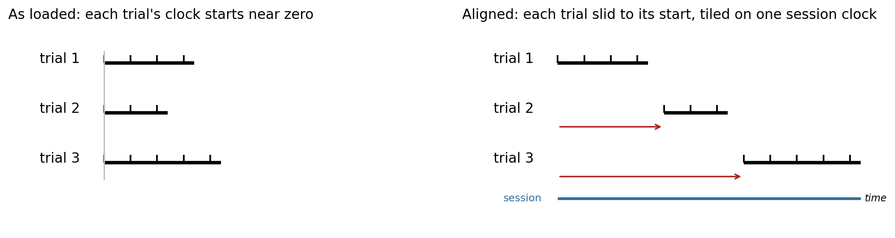
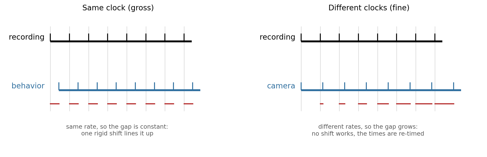
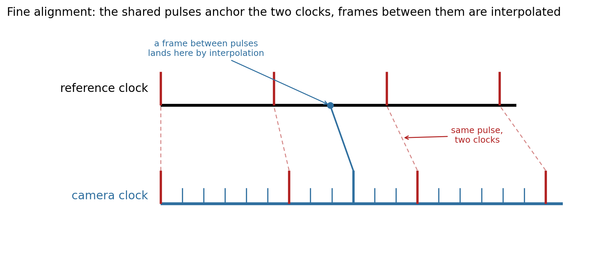

Temporal Alignment
==================

Neurophysiology experiments combine several acquisition systems, and each system timestamps its data against its own
**clock**. A conversion has to bring all of them onto one shared clock, the NWB file's ``session_start_time``: every
time stored in the file is measured from it.

NeuroConv is deliberately agnostic about what the correct timestamps are; it does not try to infer them, because only
you know how your systems were wired and synchronized. When the source carries timing information the interface
pre-loads it, so you start from the times the acquisition system actually recorded. Those times are on that system's
clock, which need not coincide with the session clock. By default the interface writes them unchanged, which amounts
to assuming the two clocks coincide; when they do not, aligning is how you place the system's data on the session
clock. NeuroConv never resamples or changes the data values; it only sets the timing of the samples you already have.

Gross and fine alignment
------------------------

You might record a session as separate trials on the same rig, each file's clock starting near zero. Nothing about any
single trial is wrong; the trials just have to be laid out one after another on the session timeline, and sliding each
to the time it began does it, with nothing inside a trial touched. Or a behavior box that ran alongside the recording
may have started a few seconds later: a single trigger shared between the two tells you the gap, and because both ran
at the same rate, sliding the box's whole stream by that one number lines them up. Both are **gross alignment**: the
samples are already correctly spaced on a clock you trust, and only their placement as a whole is off, so a single
rigid shift fixes it.

         right, each trial is shifted to its own start so the three tile one after another along one session clock,
         the samples inside each trial untouched.

Now put a camera next to the electrophysiology. It keeps its own clock, and because the two clocks tick at slightly
different rates its frame times slide away from the recording, tens of milliseconds by the end of a long session, so
no single shift fixes both the first frame and the last. Two acquisition systems logging in parallel do the same, each
free-running on its own oscillator at a nominally identical rate: they drift apart as the session runs on. This is
**fine alignment**: the streams live on different clocks that drift, so the times themselves have to be rewritten,
usually by interpolating each stream onto the reference clock through synchronization pulses the systems share.

         every recording instant, so one rigid shift lines it up. On the right, the gap to each recording instant
         grows across the session as the clocks drift, so no single shift works and the times must be rewritten.

An operational way to think about this is to ask whether one rigid shift could ever be right: it is gross alignment
if sliding the stream as a whole lines it up, and fine alignment if sliding makes the beginning line up but leaves
the end wrong, because the gap itself grows as the session runs on.

Gross alignment
---------------

Gross alignment is the case where your data is already on one clock and only its placement is wrong. Every interface
exposes its alignment methods under ``interface.alignment``, and the whole-interface tool for gross alignment is
``shift_times``.

``alignment.shift_times(delta)`` moves **every time-bearing object in the interface**, every object it writes that
carries a time, by ``delta`` seconds. It
is a rigid translation: the spacing between samples, the gaps between events, and all durations are preserved,
only the position on the shared clock changes. It is relative, so repeated calls accumulate.

.. code-block:: python

    events_interface.alignment.shift_times(3.0)   # every event now sits 3.0 seconds later on the session clock

One canonical case is a secondary system that sends a single pulse to the primary system as it starts: that pulse
tells you the offset, and one call moves the whole stream onto the shared clock. Another is a session recorded as
separate trial files, each clock starting near zero, where one shift per trial lays them out along the session clock
with nothing inside a trial touched.

.. image:: ../_static/images/time_alignment_coarse.png
   :alt: A stream slides as a rigid block onto the recording clock, its sample spacing intact.
   :width: 600px
   :align: center

Because the move is rigid, all the objects in the interface keep their relationships exactly: they slide together by
the same amount. ``alignment.shift_times`` moves the whole set at once, which is what keeps their relative timing
intact: those objects came off one acquisition system, so their timing relative to one another is already correct. The
same holds one level up: a converter can shift everything it holds at once, moving all of its interfaces together by
one amount, as long as each of them exposes an ``alignment``.

.. image:: ../_static/images/time_alignment_moves_together.png
   :alt: An interface's time-bearing objects all shift together by the same amount; the gaps between them never change.
   :width: 600px
   :align: center

Fine alignment
--------------

Fine alignment is the case where the clocks themselves disagree, so no single shift lines things up and the times have
to be rewritten. There are two ways to do it, and which you use depends on what you already have. The examples here
assume the interface holds a single time-bearing object, so the calls act on it directly; interfaces with several are
covered in the next section.

**Set the times directly.** When you already have the correct per-sample times, from a per-sample synchronization
signal or any computation you trust, hand them to ``set_times``:

.. code-block:: python

    imaging_interface.alignment.set_times(frame_times)   # write these times for the object

**Re-time against a reference clock.** When you do not have the true times, you recover them by comparison with a clock
you trust, the reference clock.

A stream keeps its timestamps on its own clock. Beyond a constant offset, which a shift already handles, two clocks
can diverge in ways no shift can absorb: drifting at slightly different rates, or varying irregularly with no single
rate connecting them at all. When a constant shift cannot reconcile them, you map one clock onto the other point by
point.

That map comes from events the two clocks share, and two systems on different clocks have none, so you create some.
Feed one physical signal into both at once and each records the very same events on its own clock; in practice that
signal is a train of TTL (transistor-transistor logic) pulses, wired into both systems so every pulse is timestamped
twice. Each pulse is then a pair, its time on the reference clock and its time on the stream's clock, and the pairs pin
the two together. ``remap_times`` re-expresses the object's timestamps through those pairs, interpolating for the
samples that fall between pulses:

.. code-block:: python

    # The shared pulses, timestamped on each clock.
    pulses_local = ...       # on the interface's own clock
    pulses_reference = ...   # the same pulses on the reference clock

    imaging_interface.alignment.remap_times(
        stream_sync_times=pulses_local,
        reference_sync_times=pulses_reference,
    )

         times to the other's. Because the pulses are sparser than the camera's frames, a frame that falls between
         two pulses is placed on the reference clock by interpolating between the surrounding anchors.

Multiple time-bearing objects
-----------------------------

Some interfaces carry only a single object to place in time, a ``TwoPhotonSeries`` in an imaging interface, for
instance, and the calls in the previous section act on it directly. Others carry several: a pose interface has one
object per keypoint, an events interface one per event type, and a converter gathers the objects of every interface it
holds. When there is more than one, you name which you mean.

Alignment acts on an interface's time-bearing objects: the objects it writes that carry a time coordinate relative
to ``session_start_time``. Which objects those are depends on the interface. A few examples:

.. list-table::
   :header-rows: 1
   :widths: 40 60

   * - Interface
     - Time-bearing objects
   * - Recording
     - the ``ElectricalSeries``
   * - Events
     - each ``EventsTable``
   * - Pose estimation
     - each ``PoseEstimationSeries``
   * - Trials or epochs
     - the ``TimeIntervals`` table

In a generic ``DynamicTable`` (trials, epochs, or one of your own) the time-bearing values are the columns whose names
end in ``_time``, an NWB convention the `NWB Inspector checks
<https://nwbinspector.readthedocs.io/en/dev/best_practices/tables.html#timing-columns>`_. Structural and metadata
objects (a ``Device``, an ``electrodes`` table) carry no time and are left untouched.

``alignment`` exposes those objects as a mapping: its keys enumerate them, and indexing one reaches it, giving you the
same ``set_times`` / ``remap_times`` / ``shift_times`` on that single object:

.. code-block:: python

    pose_interface.alignment.keys()                    # e.g. ("nose", "left_ear", "tail_base")

    pose_interface.alignment["nose"].set_times(times)
    pose_interface.alignment["nose"].remap_times(stream_sync_times=pulses_local, reference_sync_times=pulses_reference)
    pose_interface.alignment["nose"].shift_times(0.5)

Two of these do not need a key even when there are several objects, because their correction is the same for all of
them: ``shift_times`` adds one offset to every object, and ``remap_times`` applies one clock's map to every object (a
single acquisition clock, one correction). ``set_times`` is the exception, its literal per-sample values belong to one
object, so with several you must name which.

A per-object ``shift_times`` breaks the inter-object relationships the whole-interface shift is designed to protect,
so use it only for a deliberate single-object correction (a fixed cable latency on one stream, say), not to place a
whole interface.

Alignment in a converter
------------------------

A converter is where alignment usually happens, since that is where several interfaces meet. Override
:py:meth:`.NWBConverter.temporally_align_data_interfaces` and place each stream on the shared clock:

.. code-block:: python

    from neuroconv import NWBConverter

    class ExampleNWBConverter(NWBConverter):
        data_interface_classes = dict(
            Recording=SpikeGLXRecordingInterface,
            Behavior=TDTEventsInterface,
        )

        def temporally_align_data_interfaces(self, metadata=None, conversion_options=None):
            behavior = self.data_interface_objects["Behavior"]
            behavior_offset = ...  # how far the behavior box starts after the recording, however you obtain it
            behavior.alignment.shift_times(behavior_offset)

Inside this method each interface exposes its full alignment surface under ``alignment``, so you apply whatever each
stream needs: ``alignment.shift_times`` to reposition one, ``alignment.remap_times`` to re-time a drifting one against
the reference. Each interface has its own clock and its own correction, so this is a loop over interfaces, never one
global remap. One caveat applies to any of them: they mutate the live interface, so an alignment step that runs twice
compounds (a ``shift_times`` would shift twice); build the converter fresh per conversion.
