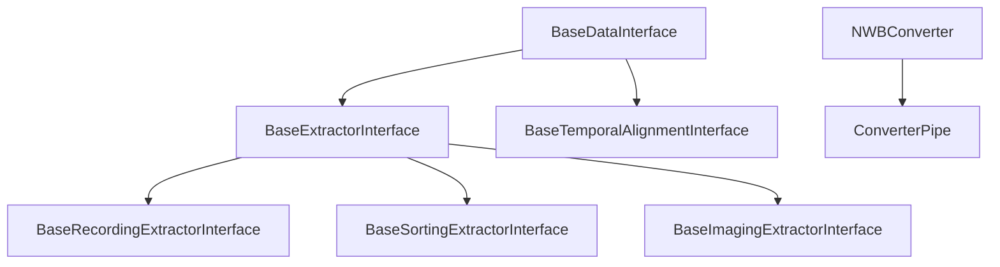
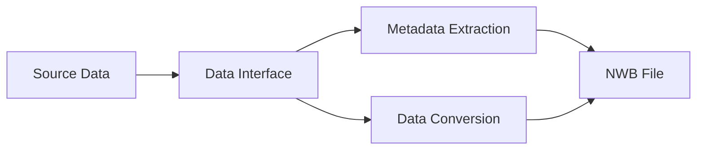
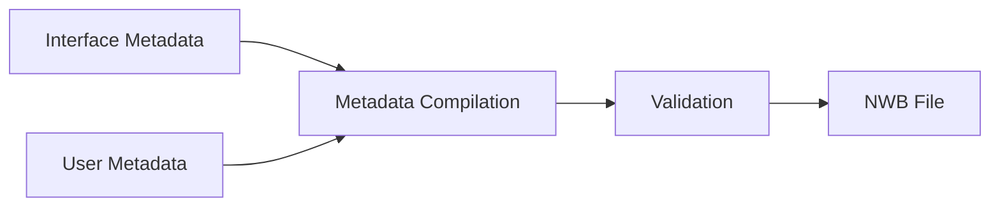

# System Patterns

## Core Architecture

### Class Hierarchy


### Key Components

1. **BaseDataInterface**
   - Abstract base class for all data interfaces
   - Defines core conversion protocol
   - Handles metadata management
   - Provides validation methods
   ```python
   class BaseDataInterface(ABC):
       @abstractmethod
       def add_to_nwbfile(self, nwbfile, metadata, **conversion_options)
       def get_metadata(self) -> dict
       def validate_metadata(self, metadata: dict)
       def run_conversion(self, nwbfile_path, metadata, **conversion_options)
   ```

2. **NWBConverter**
   - Manages multiple data interfaces
   - Coordinates conversion process
   - Handles metadata compilation
   - Manages temporal alignment
   ```python
   class NWBConverter:
       data_interface_classes = None
       def get_metadata(self) -> dict
       def run_conversion(self, nwbfile_path, metadata, **conversion_options)
       def temporally_align_data_interfaces(self, metadata, conversion_options)
   ```

3. **ConverterPipe**
   - Specialized converter for pre-initialized interfaces
   - Supports sequential processing
   - Handles interface naming
   - Manages conversion options

## Design Patterns

### Factory Pattern
- Used in interface creation
- Dynamically loads format-specific dependencies
- Provides consistent interface initialization
- Example: `get_extractor()` class method

### Strategy Pattern
- Different conversion strategies per format
- Common interface across implementations
- Configurable behavior through options
- Example: Backend configurations (HDF5/Zarr)

### Template Method Pattern
- Base conversion workflow in abstract class
- Format-specific implementations in subclasses
- Common validation and metadata handling
- Example: `run_conversion()` method

### Observer Pattern
- Progress reporting during conversion
- Error notification system
- Verbose mode for debugging
- Example: `tqdm` progress bars

## Component Relationships

### Data Flow


### Metadata Flow


## Extension Mechanisms

### New Format Support
1. Create new interface class
2. Implement required methods
3. Define metadata schema
4. Add format-specific optimizations

### Custom Converters
1. Inherit from NWBConverter
2. Define data_interface_classes
3. Implement custom alignment
4. Add specialized methods

### Backend Customization
1. Create backend configuration
2. Define chunking strategy
3. Set compression options
4. Configure buffer sizes

## Error Handling

### Validation Layers
1. Source data validation
2. Metadata validation
3. Conversion option validation
4. Output validation

### Error Types
1. ValidationError - Invalid data/metadata
2. ConversionError - Processing failure
3. DependencyError - Missing requirements
4. ConfigurationError - Invalid settings

## Performance Patterns

### Memory Management
1. Piece-wise data reading
2. Chunked data writing
3. Buffer size optimization
4. Memory usage monitoring

### Optimization Strategies
1. Automatic chunking
2. Compression selection
3. Parallel processing
4. Cache management

## Testing Patterns

### Test Categories
1. Unit tests per interface
2. Integration tests
3. Format-specific tests
4. Performance tests

### Test Infrastructure
1. Mock interfaces
2. Test data generation
3. Validation helpers
4. Performance benchmarks

## Documentation Patterns

### Code Documentation
1. Type hints
2. Numpy-style docstrings
3. Clear examples
4. Version compatibility notes

### User Documentation
1. Format-specific guides
2. API reference
3. Example gallery
4. Troubleshooting guides
